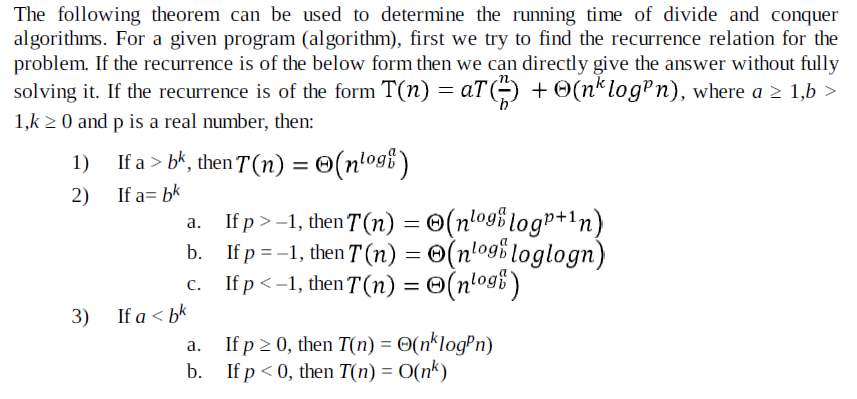

## Algorithm Analysis

### Basic time and space complexity analysis:

*  - We use **Big O** notation to show **worst case** complexity.
   - **Omega(&omega;)** for **best time** complexity
   - **Theta (&theta;)** when both worst and best time complexity **are equal**.
*  An algorithm with k-nested loops of about n iterations each has $O(n^k)$ complexity
*  If your algorithm is recursive with b recursive calls per level and has L levels, the algorithm has roughly $O(b^L)$ complexity, but this is a only a rough upper bound. The actual complexity depends on what actions are done per level and whether pruning is possible. 
*  A Dynamic Programming algorithm or other iterative routine which processes a 2D n×n matrix in $O(k)$ per cell runs in $O(k ×n^2)$ time.

- $c$ ≪ $loglogn$ ≪ $log^an$ ≪ $n$ << $nlogn$ << $n^b$ ≪ $c^n$ ≪ $n!$ ≪ $n^n$     [n→∞, and fixed a>0,b>1,c>1 and any real d]
- https://www.khanacademy.org/computing/computer-science/algorithms/asymptotic-notation/e/quiz--asymptotic-notation

* **Master Theorem:** 

### Familiarity with these bounds: 

* $2^{10} =1,024≈10^3$  
  $2^{20} =1,048,576≈10^6 $

* **32-bit signed integers (int)** and **64-bit signed integers (long long)** have upper limits of $2^{31}−1 ≈2×10^9$ (safe for up to $\approx9$ decimal digits) and $2^{63}−1 \approx 9×10^{18}$ (safe for up to $\approx$ 18 decimal digits) respectively. 

*  **Unsigned integers** can be used if only **non-negative** numbers are required. **32-bit unsigned integers (unsigned int) and 64-bit unsigned integers (unsigned long long)** have upper limits of $2^{32}−1 ≈4×10^9$ and $2^{64}−1 \approx 1.8×10^{19}$ respectively

* $1M = 10^6$

### Array

* deallocate dynamic array using -> `delete[]` operator, Its call destructor for every object(element) of array. 

### Linked List

* Arrays are faster to read but linked lists are **faster to write in between**.
  > In arrays, If we want to insert or delete an element in between the array we have to shift all the following elements accordingly.
  But in case of linked list we just need to move some pointers and thats it.

### Bitwise Techniques

* **bitset**<4> num=4

*  To **multiply/divide** an integer by 2 (or any power of 2), we only need to **shift the bits** in the integer left/right, respectively.

* To check if the $j^(th)$ item of the number is on, use the bitwise AND operation **T = S & (1<< j).**

*  To **clear** $j^(th)$ bit use **S &=∼(1 << j)**

* To **toggle** $j^(th)$ bit use **XOR** as **S ^= (1 << j)*** 

* To get the value of the  **least significant bit** that is on (first from the right), use **T = (S & (-S)**

* ~N = -(N-1)

* Number of set bits:  
    * `while(n>0) n&=(n-1)`, **Time Complexity: O(no. of set bits)**
    * `__builtin_popcount(n)`

## Modular Arithmatic

* Addition: (a+b)%m = ((a%m) + (b%m))%m
* Substraction: (a-b)%m = ((a%m) - (b%m) + m)%m
* Multiplication: (a*b)%m = ((a%m) * (b%m))%m

* **Division:**  
> **Fermat’s little theorem**: $a^{-1} = a^{m-2}$%m  
> https://www.programmersarmy.com/modular2.html

**Division: (a/b)%m = (a*power(a,m-2))%m = ((a%m) * (x%m))%m**

## Recursion

* Recursion function also takes **stack space** for recursive function calling 
### Backtracking

* Backtracking is a sort of refined brute force.
* Backtracking speeds the exhaustive search by **pruning**.
* Soometimes, best algorithm for a problem is to try all possibilities

## Dynamic Programming

- Identification: 
    - Choices (It means recursive)
    - Optimal Substructure (max, min largest,etc.)

- Approach: Recusrsive (Use choice diagram) -> Memoisation -> Bottom Up

